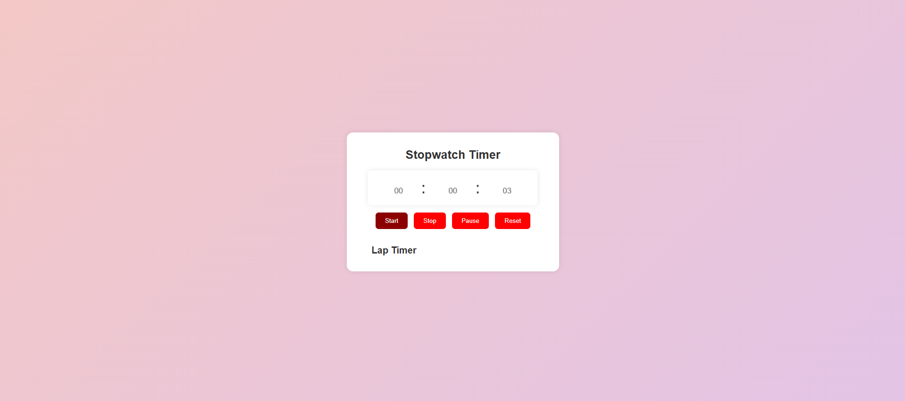
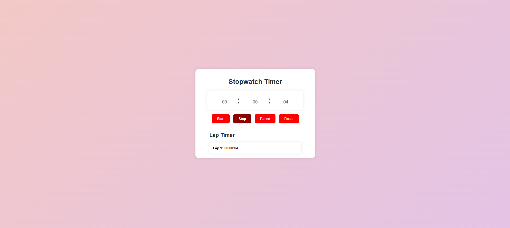
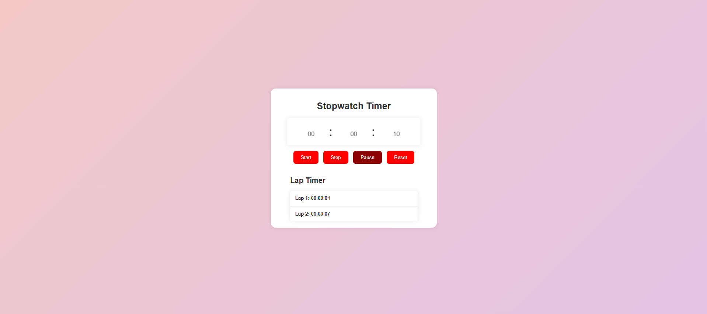
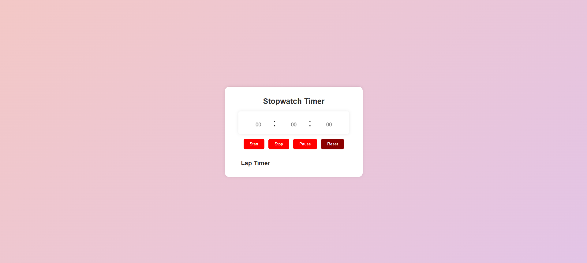

# Stopwatch Timer

## Overview
The Stopwatch Timer app is a simple, user-friendly tool designed to help you track elapsed time, pause while keeping the timer running, and record lap times. It features an intuitive interface and responsive controls that make it easy to use for a variety of purposes, whether you're timing workouts, races, or any other activities.

## Features
- **Start, Pause, and Stop Timer**: Easily start, pause, and stop the timer to track elapsed time.
- **Lap Recording**: Capture lap times to track intervals or multiple segments of a task.
- **Responsive Design**: Designed to work on all modern browsers, ensuring a seamless experience on desktops, tablets, and mobile devices.
- **Real-Time Display**: Showcasing hours, minutes, and seconds, keeping you informed about the current time.
- **Reset Timer & Lap List**: Clear the timer and lap history with a single click to start fresh.

## How It Works
1. **Starting the Timer**: Click the "Start" button to begin tracking time. The timer will run continuously until you pause or stop it.
2. **Stopping the Timer**: Click the "Stop" button to halt the timer completely. Lap times will also be recorded before stopping.
3. **Pausing the Timer**: Click the "Pause" button to stop the timer while retaining the current time. Lap times will still be recorded.
4. **Resetting the Timer**: Use the "Reset" button to clear the timer and the lap list, returning to the starting state.

## How to Use
1. Open the HTML file in a web browser.
2. Use the buttons to control the stopwatch:
   - **Start**: Begins tracking time.
   - **Stop**: Halts the timer and records lap times.
   - **Pause**: Pauses the timer but keeps counting time, allowing you to add lap times.
   - **Reset**: Clears the timer and lap list.

3. View your lap times in the "Lap List" section.
4. Repeat as necessary to track multiple sessions.

## Screenshots
Here are examples of how the Stopwatch Timer looks during different states:

### 1. **Start Timer**
   

### 2. **Stop Timer**
   

### 3. **Pause Timer**
   

### 4. **Reset Timer**
   

## Technologies Used
- **HTML**: Used for the structure and layout.
- **CSS**: Provides styling for the stopwatch app.
- **JavaScript**: Powers the functionality and interactive behavior.

## Benefits
- **Convenience**: Ideal for activities that require precise timing like workouts, races, meetings, or cooking.
- **Productivity**: Helps improve time management by providing clear visibility of elapsed time and lap intervals.
- **Versatility**: Suitable for various applications such as fitness tracking, project management, or general timing needs.
- **User-Friendly**: Simple interface ensures ease of use without any unnecessary complexity.
-----
Contributions are welcome! If you'd like to contribute to this project, please feel free to submit a pull request with your improvements or fixes. Your feedback is also valuable to enhance the functionality and design of the Stopwatch Timer app.